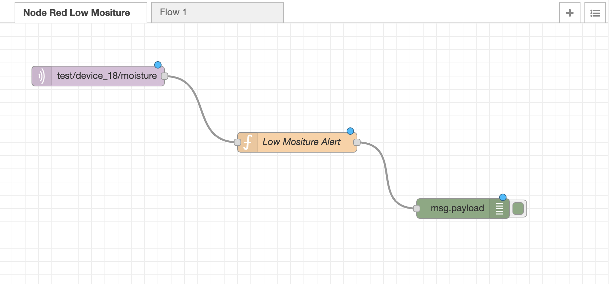
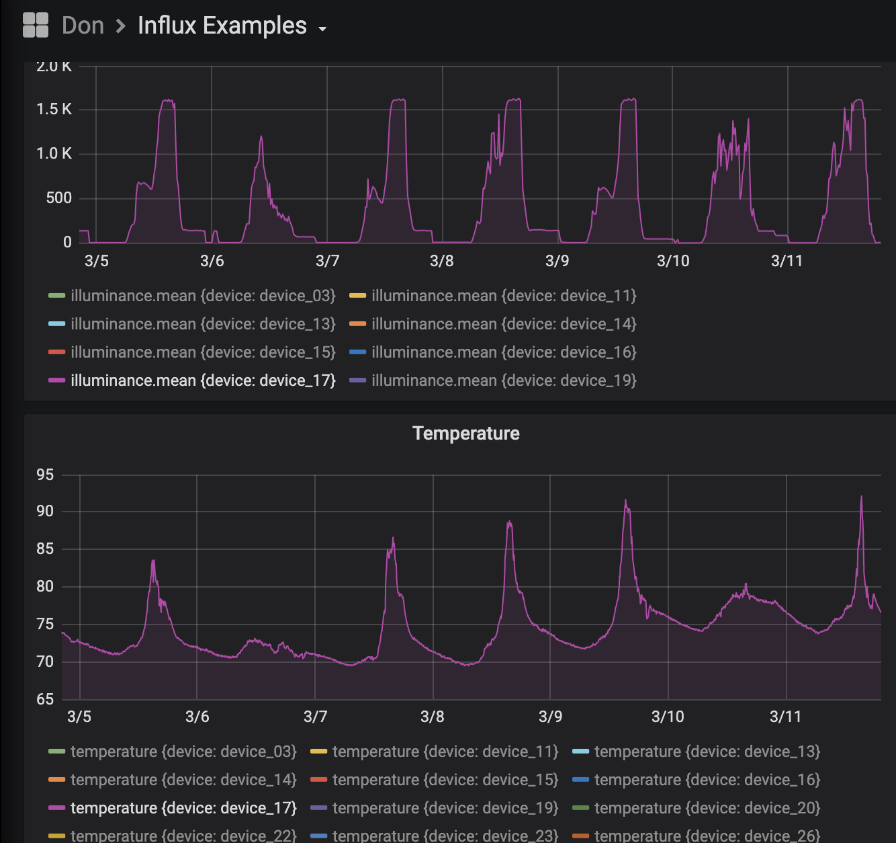
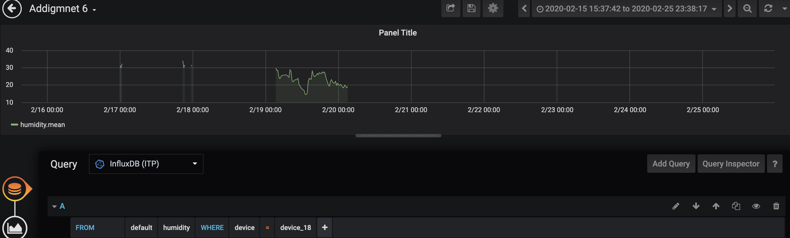
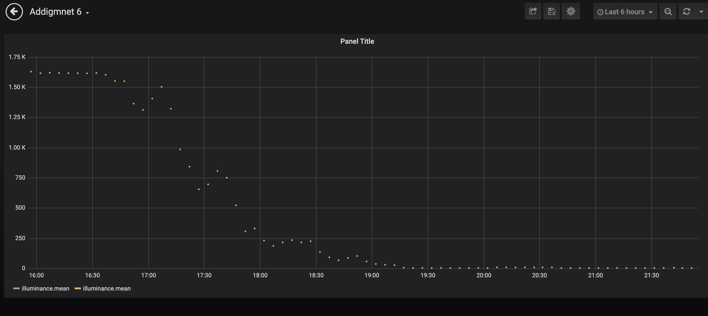
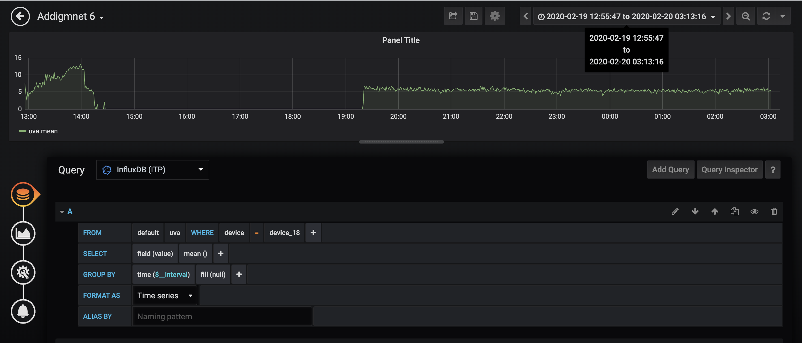
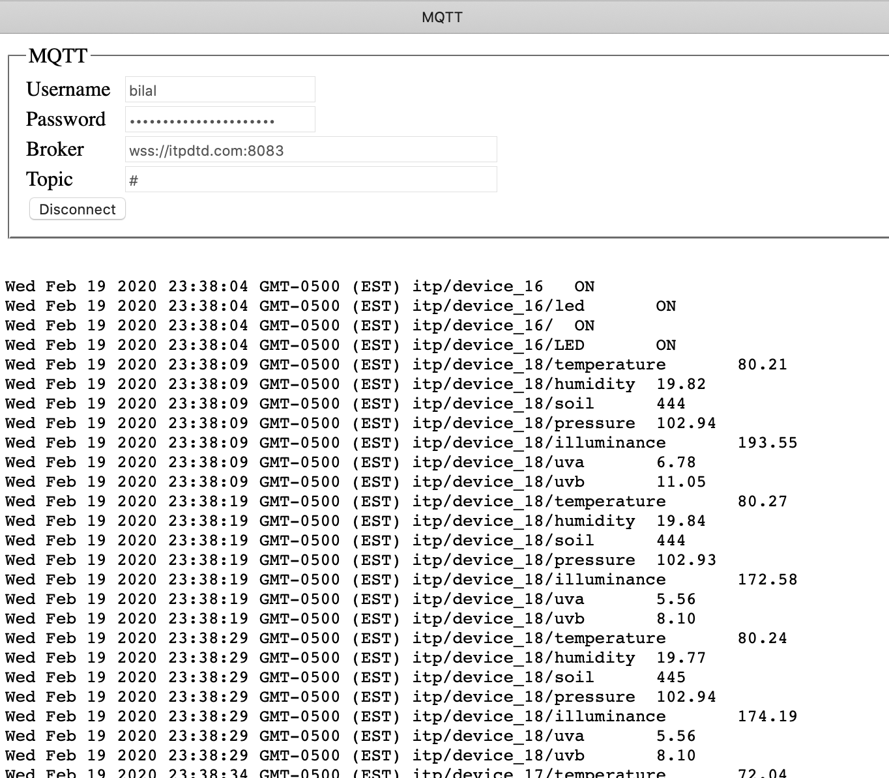
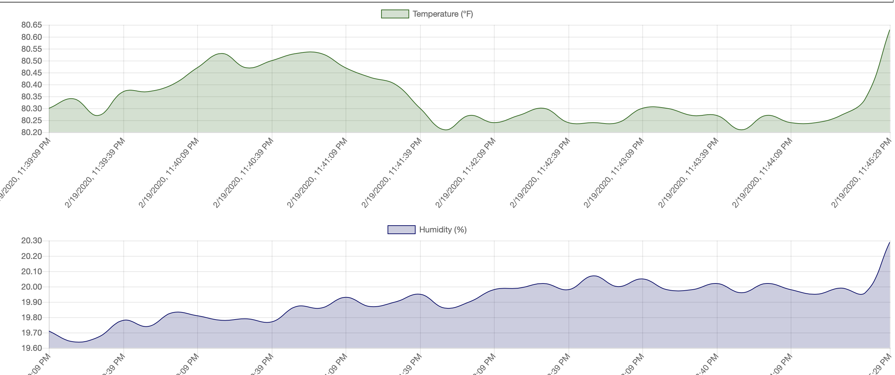

# Plant to Database

### Tools that make queries an easy business

#### Node Red

An MQTTT Input is configured with itptd as the broker, and the topic is moisture for device 18. Then we introduce a function with a code for a message alert for when moisture is lower than 400. A message will be received in the debug window in Node Red whenever that is the condition. This would help me water the plant methodically, whenever the moisture is low I will be notified to water it. 




#### Grafana  

When querying device 17, for illuminance and temperature one can see, the temperature, and illuminance drop each night over the past week. 



When querying device 18 fior humidity, it can be seen that the device was last on in February. 



Similarly we can see that device 17 was taken off over the past 6 hours. 




Zooming in on UVA data shows 




#### "Oh wow green energy.. a plant producing electricity!" 


We will be collecting environment data from the plant placed in my room in an apartment near Prospect Park and send it to a server.  We’ll use a MKR ENV sheild, it has sensors. We don’t spend time wiring things up you just plug it in and get going. It has ENV libraries that are really easy to use. We will also use a soil monitor sensor. When we are a client we can write to a topic and publish our data. In this case we publish a JSON including temperature, humidity, pressure, illuminance, uva, uvb and soil moisture. Topics are added using the following commands.

```markdown
String temperatureTopic = "itp/" + DEVICE_ID + "/temperature";
String humidityTopic = "itp/" + DEVICE_ID + "/humidity";
String ledTopic = "itp/" + DEVICE_ID + "/led";
String soilTopic = "itp/" + DEVICE_ID + "/soil";
String pressureTopic = "itp/" + DEVICE_ID + "/pressure";
String illuminanceTopic = "itp/" + DEVICE_ID + "/illuminance";
String uvaTopic = "itp/" + DEVICE_ID + "/uva";
String uvbTopic = "itp/" + DEVICE_ID + "/uvb";
```


MQTT in addition to be lightweight gives us a serve path so its easier than HTTP. We will be using MQTT. MQTT broker does not store anything, it receives a message, it asks who is subscribing to these topics, and then sends it out to them. Our broker is itpdtd.com.

After adding a new topic for soil we add this command so we can read and send data. 

```markdown
int soil = analogRead(A0);
mqtt.beginMessage(soilTopic);
mqtt.print(soil);
mqtt.endMessage();
```
This would be done for each topic.

The soil sensor is sending values through an analog pin "analogRead(A0)". For the remaining parameters such as temperature, pressure and illuminance, the ENV sheild is doing the sensing so we have included its library in the beginning 

```markdown
#include <Arduino_MKRENV.h>
```

#### The soil sensor is inserted into a pot of cilantro for testing, and later into a praying plant in a pot of fresh soil. 


The idea is to monitor data over a period of 48 hours so we need to connect the MKR 1010 to a power outlet. For this we need to tweak the code:

```markdown
//while (!Serial) { }
```
We have to comment this bit out. This is because the code is waiting for a Serial connection before it starts running. The computer provides a serial connection. The power strip does not. 

#### The data can now be viewed on www/subscribe index.html




#### When I watered the plant the soil mositure readings deepen from 444 to 380. 


Data visualization tools such as MQTT explorer are there but I have used the chart available for class exercises that visualizes environment temperature and humidity.



#### When illuminance changes in the room the data for illuminance changes 


This was a great exercise in transferring data over MQTT from sensors to the server. I am looking forward to manipulate this data and visualize it in the coming weeks in class.

To view the code I have used for this project please go to my [Github Repository](https://github.com/bsehgol/devicetodatabase/blob/master/soilmonitor/soilmonitor.ino)
